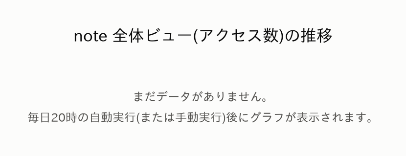

# note-article

## note アクセス数の自動記録・グラフ化

毎日 **20:00(日本時間)** に GitHub Actions が note.com のダッシュボード
([https://note.com/sitesettings/stats](https://note.com/sitesettings/stats) と同じデータ)を自動取得し、
アクセス数を記録してこのグラフを更新します。

> ⚠️ **このリポジトリが Public(公開)の場合、記録したアクセス数
> (`data/` 内の記事別ビュー数を含む)は誰でも閲覧できます。**
> 見られたくない場合は、リポジトリの Settings → General → Danger Zone →
> Change visibility から Private に変更してください(Private でもこの仕組みはそのまま動きます)。

### 初回セットアップ(1回だけ)

自動取得には note.com のログイン Cookie が必要です。

1. **Cookie を取り出す**(ふだんのブラウザで note.com にログインした状態で、どちらかの方法で)
   - 拡張機能「[Cookie-Editor](https://cookie-editor.com/)」で note.com を開き、Export → JSON でコピー
     (`tools/note_auto_post` で使う `note_cookies.json` と同じものです)
   - または F12(開発者ツール)→「アプリケーション」→「Cookie」→ `https://note.com` →
     `_note_session_v5` の「値」をコピー
2. **GitHub に Secret として登録する**
   - このリポジトリの **Settings → Secrets and variables → Actions → New repository secret**
   - Name: `NOTE_COOKIE` / Secret: 手順1でコピーした内容をそのまま貼り付け → Add secret
   - Secret は GitHub が暗号化して保管し、ログにも表示されません
3. **動作確認(手動実行)**
   - **Actions タブ → 「note アクセス数の記録」→ Run workflow** で今すぐ実行できます
   - 成功すると `data/stats.csv` に1行追加され、上のグラフが更新されます

### 記録される内容

| ファイル | 内容 |
|---|---|
| `data/stats.csv` | 1日1行のサマリー(全体ビュー・スキ・コメント・記事数) |
| `data/raw/日付.json` | その日の記事別の生データ(あとで記事別の分析にも使えます) |
| `docs/stats.png` | 累計ビューの推移と、1日ごとの増加数のグラフ |

### 注意事項・困ったとき

- **20:00 ぴったりには動かないことがあります。** GitHub Actions の仕様で、混雑時は数分〜数十分遅れます。
- **自動実行はデフォルトブランチ(main)にこのファイルがあるときだけ動きます。** ブランチにある間は手動実行(Run workflow)で試せます。
- **実行が失敗するようになったら、Cookie の期限切れです。** GitHub から失敗通知メールが届くので、
  初回セットアップと同じ手順で Cookie を取り直し、Secret を更新(`NOTE_COOKIE` の鉛筆マーク)してください。
- 取得は1日1回・自分のアカウントのデータのみで、note の非公式 API を利用しています。
  note 側の仕様変更で動かなくなる可能性はありますが、生データを毎日保存しているので記録は失われません。

## tools

- `tools/note_auto_post` … Markdown ファイルから note.com の下書きを自動入力するツール
- `tools/note_stats` … アクセス数の取得(`fetch_stats.py`)とグラフ生成(`make_graph.py`)
